<!-- 220328.094653 -->

<h1 align="center">

  
  <br>
  Creating a custom myAvatar™ web service
  <br>

</h1>

<h6 align="center">
  Last updated: March 28, 2022
</h6>

***

# CUSTOM MYAVATAR WEB SERVICES
If you are curious as to how the MAWS was created, or you are looking for some information on creating your own custom web service for myAvatar™, these are the steps I took.

I'll be using the same naming conventions that I did with MAWS, so you should modify things as you see fit.

## BEFORE YOU BEGIN
To create MAWS, I used:
* [Visual Studio Community 2019](https://visualstudio.microsoft.com/vs/) (including the extensions listed [here](https://github.com/APrettyCoolProgram/my-development-environment))
* [Visual Studio Code](https://code.visualstudio.com/?wt.mc_id=DX_841432) (including the extensions listed [here](https://github.com/APrettyCoolProgram/my-development-environment))
* [GitHub Desktop](https://desktop.github.com/)
* [.NET Framework 4.6](https://dotnet.microsoft.com/download/dotnet-framework)

### Why .NET Framework 4.6?
Personally, I would rather use .NET Core 5, but as of .NET Core 5.1, SOAP web services are not supported. I would imagine other versions of the .NET Framework would be fine, but most myAvatool-related development has been using v4.6, so I'm sticking with that.

### What language?
While you can (probably) use any language to create a custom web service for myAvatar™, these instructions will walk through creating a web service in C#.

# CREATING A NEW PROJECT
First, we need to create an empty ASP.NET Web Application project. Using Visual Studio 2019:

1. Click **Create a new project**

<h6 align="center">

  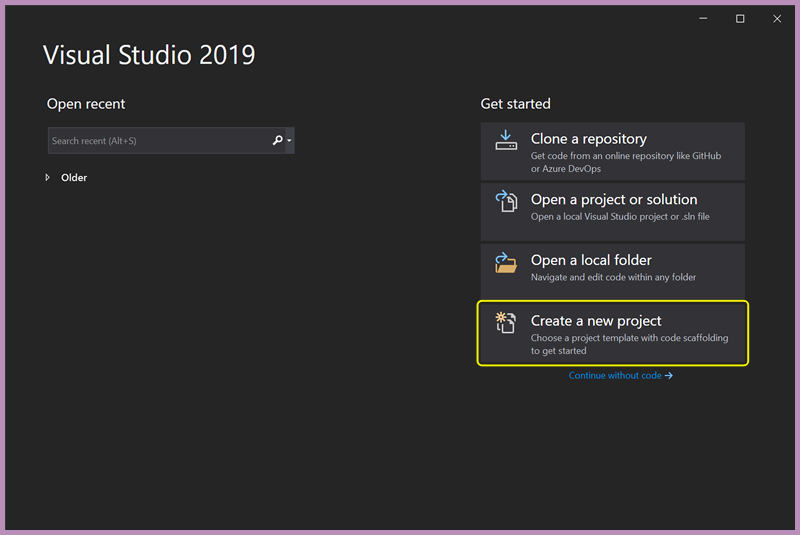
  <br>
  Starting a new project in Visual Studio 2019

</h6>
<br>

2. Search for "*ASP.NET*"
3. Select **ASP.NET Web Application (.NET Framework)**
4. Click **Next**

<h6 align="center">

  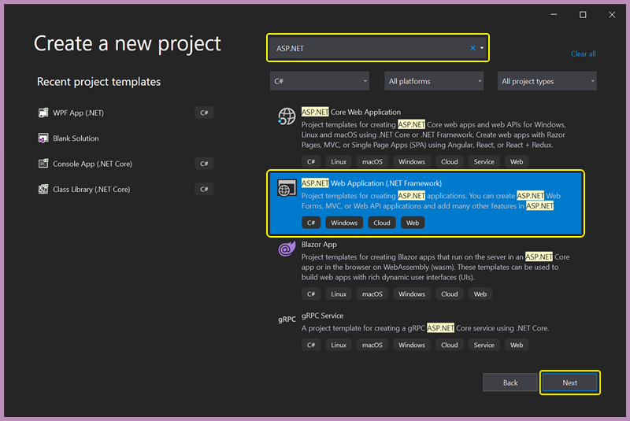
  <br>
  Choosing a project template

</h6>
<br>

5. Complete the **Project Name** field (in this example, the project name is "*MyAvatoolWebService*")
6. Choose a **Location** for your project
7. Verify the **Framwork** is "*.NET Framework 4.6*"
8. Click **Create**

<h6 align="center">

  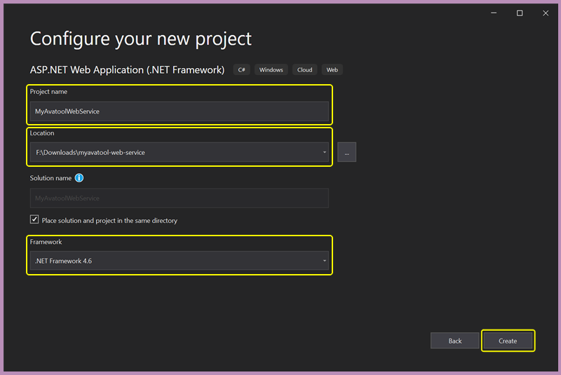
  <br>
  Configuring the project
  
</h6>
<br>

9. In the *Create a new ASP.NET Core Web Application dialog*, select **Empty**
10. Verify that **Configure for HTTPS** (under *Advanced*) is checked
11. Click **Create**

<h6 align="center">

  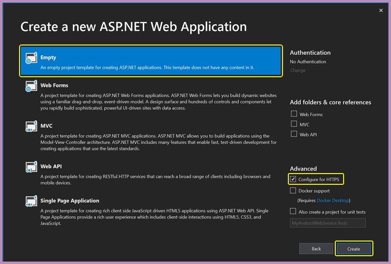
  <br>
  Creating the project
  
</h6>
<br>

Once the project is created (it may take a few minutes), you will have a brand new, clean ASP.NET Web Application that you can use to build your custom web service for myAvatar™!

<h6 align="center">

  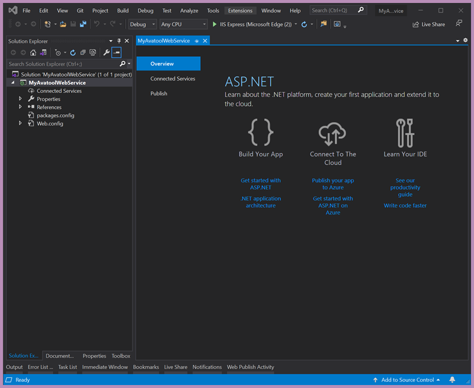
  <br>
  A nice new, clean app!
  
</h6>

# ADDING A NEW .ASMX WEB SERVICE TO THE PROJECT
Since we created an empty project, there aren't any valid web services available, so we will need to create one.

1. Right click the **Avatool-Web-Service** *project*
2. Choose **Add** > **New Item...**

<h6 align="center">

  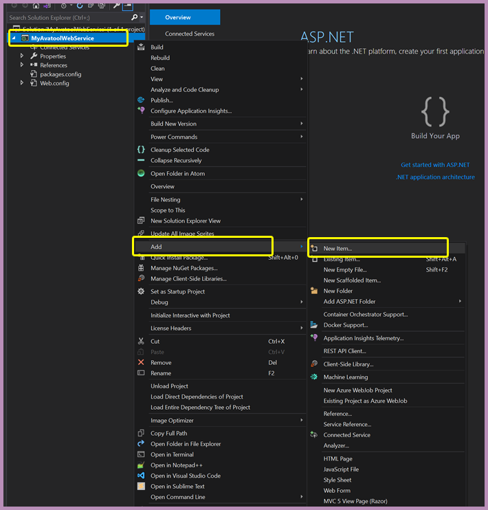
  <br>
  Adding a new item to the project
  
</h6>
<br>

3. Choose **Visual C#** > **Web** > **Web Service (ASMX**)
4. Name the web service **MyAvatoolWebService.asmx**
5. Click **Add**

<h6 align="center">

  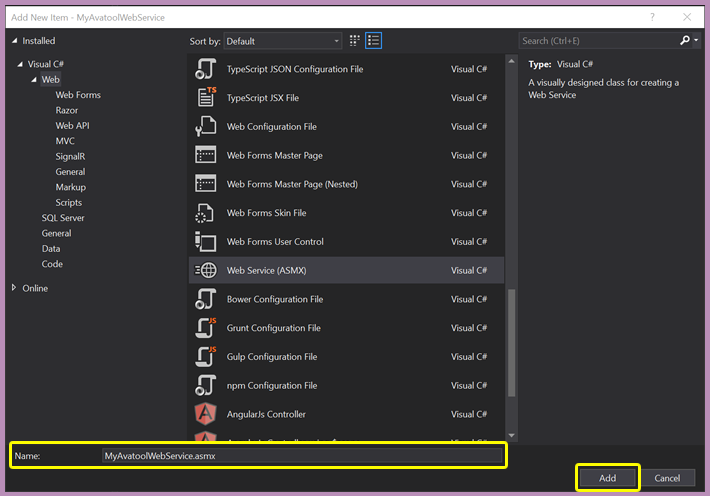
  <br>
  Adding a new web service to the project
  
</h6>
<br>

6. Right click the **AvatoolWebService.asmx** file and choose **Set as Start Page**

<h6 align="center">

  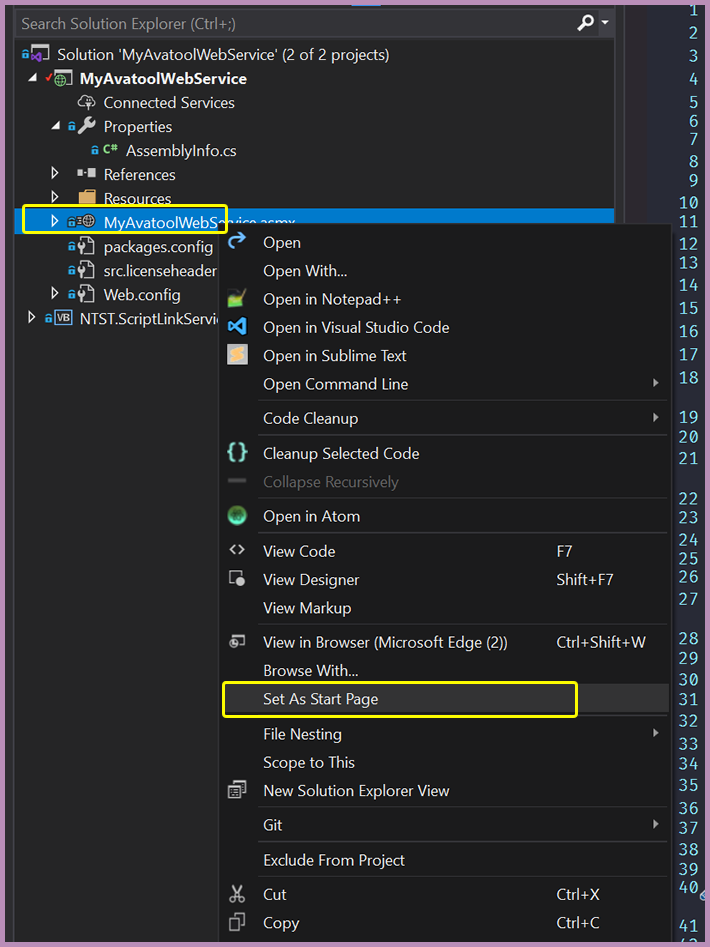
  <br>
  Setting the web service start page
  
</h6>
<br>

# ADDING THE NETSMART SCRIPTLINK SERVICE TO THE PROJECT
In order for our new MyAvatoolWebService Web Service to work, we'll need to add the *Netsmart ScriptLink Service* to our project.

## Downloading the Netsmart ScriptLink Service
The Netsmart ScriptLink Service is bundled with the "Brief ScriptLink Tutorial with OptionObject2", which you will need to download from the Netsmart Cares portal.

1. Login to the *[Netsmart Cares portal](https://netsmartcares.force.com/s/login/)*
2. Go to the *Application Exchange* by choosing **Community** > **App Exchange**

<h6 align="center">

  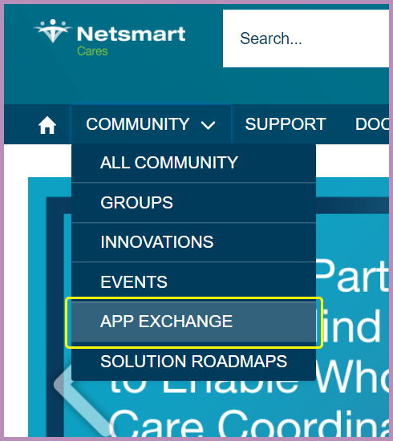
  <br>
  Navigating to the Netsmart Cares App Exchange
  
</h6>
<br>

3. Under **Quick Links** choose **Avatar ScriptLink Library**
4. Find the **Brief ScriptLink Tutorial with OptionObject2** entry, and click **Download**

<h6 align="center">

  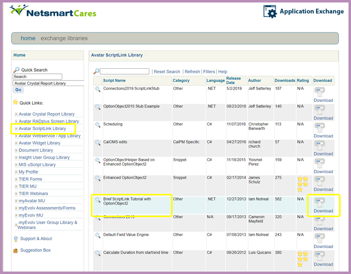
  <br>
  Downloading the Netsmart ScriptLink Service
  
</h6>
<br>

### Can't find the file in the App Exchange?
If you can't find the "Brief ScriptLink Tutorial with OptionObject2" entry in the App Exchange, you can [download it](third-party/netsmart/136_180_9_ScriptLinkTutorialWithOptionObject2.zip) from this repository.

### Make sure you have the correct file!
The downloaded file is a .zip archive with (as of January 8th, 2021) the following details:

> Name: **136_180_9_ScriptLinkTutorialWithOptionObject2.zip**<br>
> Size: **1.85MB**<br>
> MD5: **EC9445B70FD994A4453C4D0649208EC2**<br>
> SHA2-256: **899617150FF9A69A6D3A7661CD4CAC304292D5F7BA775432C9B5C3FE6AA1D8F4**<br>

## Extracting the Netsmart ScriptLink Service
The file you downloaded actually contains a bunch of stuff, most of which we don't need. 

1. Extract the contents of **136_180_9_ScriptLinkTutorialWithOptionObject2.zip**
2. Find the **NTST.ScriptLinkService.Objects/** folder in the extracted data:
```
./136_180_9_ScriptLinkTutorialWithOptionObject2/ScriptLinkTutorialWithOptionObject2/DotNetCode/ScriptLinkServiceComplete/NTST.ScriptLinkService.Objects/
```
3. Copy the **NTST.ScriptLinkService.Objects/** folder to the root of your project

When complete, the folder structure of the Avatool Web Service project should look like this:
```
/bin/
/NTST.ScriptLinkService.Objects/
/obj/
/packages/
/Properties/
/AvatoolWebService.asmx
/AvatoolWebService.asmx.cs
...
```

## Adding the Netsmart ScriptLink Service to the project
Now we need to add a reference to the Netsmart ScriptLink Service to our project.

1. Right-click the **Avatool-Web-Service** *solution*
2. Choose **Add** > **Existing Project..**

<h6 align="center">

  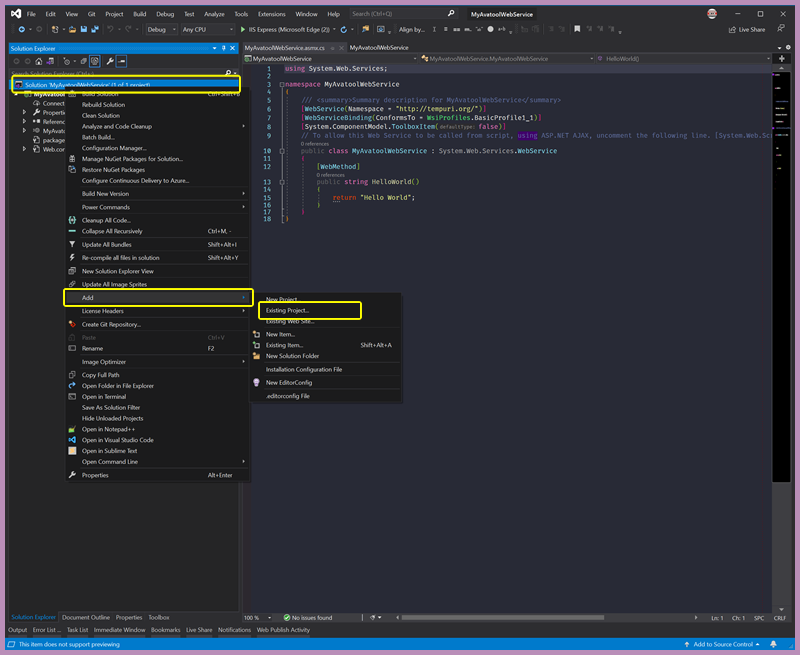
  <br>
  Adding the Netsmart ScriptLink Service, Part One
  
</h6>
<br>

3. Navigate to the **NTST.ScriptLinkService.Objects** folder in */MyAvatoolWebService/*
4. Choose the  **NTST.ScriptLinkService.Objects.vbproj** file
5. Click **Open**

<h6 align="center">

  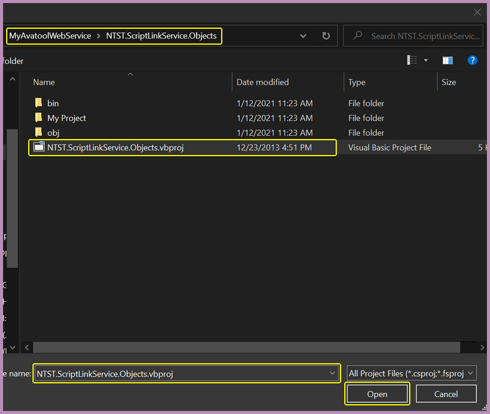
  <br>
  Adding the Netsmart ScriptLink Service, Part Two
  
</h6>
<br>

Your solution should look like this:

<h6 align="center">

  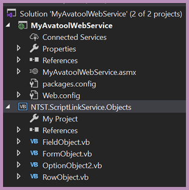
  <br>
  Does it?
  
</h6>
<br>

6. Right-click the **Avatool-Web-Service** *project*
7. Choose **Add** > **Reference..**

<h6 align="center">

  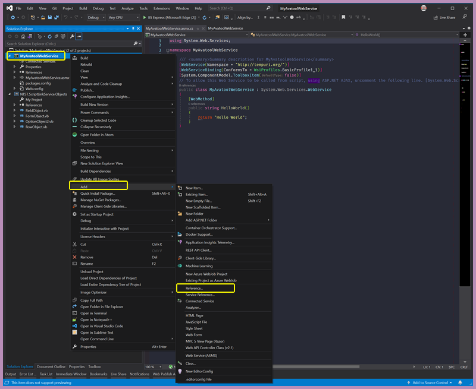
  <br>
  Adding a reference to the Netsmart ScriptLink Service, Part One
  
</h6>
<br>


8. Under **Projects**, check the box that says **NTST.ScriptLinkService.Objects**
9. Click **OK**

<h6 align="center">

  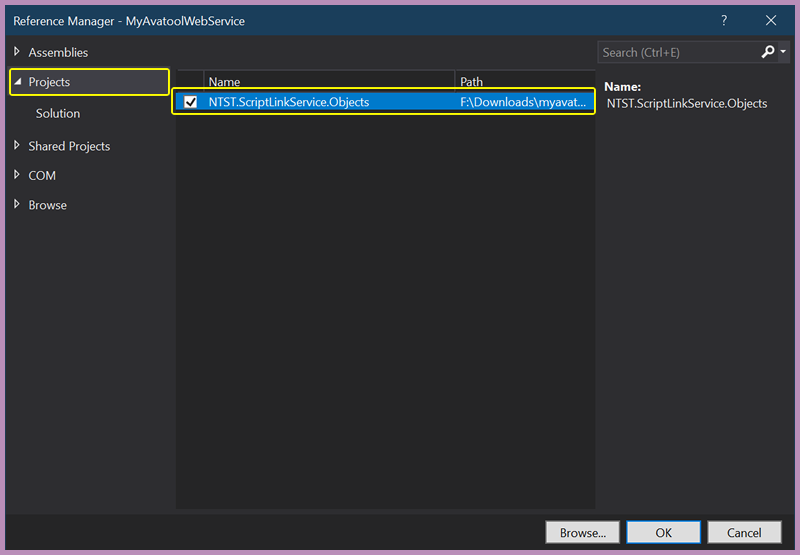
  <br>
  Adding a reference to the Netsmart ScriptLink Service, Part Two
  
</h6>
<br>


### Wrong .NET Framework version?
If a message pops up letting you know that the Netsmart ScriptLink Service targets a .NET Framework version that's not installed (in this case, .NET 3.5), change the target .NET Framework version to v4.6.


# ADDING REQUIRED METHODS
Custom web services that interface with myAvatar™ require two methods to be present.

## THE DEFAULT ASMX.CS FILE
Your *MyAvatoolWebService.asmx.cs* file should look like this:

```
using System.Web.Services;

namespace MyAvatoolWebService
{
    /// <summary>
    /// Summary description for MyAvatoolWebService
    /// </summary>
    [WebService(Namespace = "http://tempuri.org/")]
    [WebServiceBinding(ConformsTo = WsiProfiles.BasicProfile1_1)]
    [System.ComponentModel.ToolboxItem(false)]
    // To allow this Web Service to be called from script, using ASP.NET AJAX, uncomment the following line. 
    // [System.Web.Script.Services.ScriptService]
    public class MyAvatoolWebService : System.Web.Services.WebService
    {

        [WebMethod]
        public string HelloWorld()
        {
            return "Hello World";
        }
    }
}
```

We don't need the `HelloWorld()` method, so you can remove it. Now *MyAvatoolWebService.asmx.cs* file should look like this:

```
using System.Web.Services;

namespace MyAvatoolWebService
{
    /// <summary>
    /// Summary description for MyAvatoolWebService
    /// </summary>
    [WebService(Namespace = "http://tempuri.org/")]
    [WebServiceBinding(ConformsTo = WsiProfiles.BasicProfile1_1)]
    [System.ComponentModel.ToolboxItem(false)]
    // To allow this Web Service to be called from script, using ASP.NET AJAX, uncomment the following line. 
    // [System.Web.Script.Services.ScriptService]
    public class MyAvatoolWebService : System.Web.Services.WebService
    {

    }
}
```

## ADDING THE GetVersion() METHOD
The first of the required methods is called `GetVersion()`. It looks like this:
```
[WebMethod]
public string GetVersion()
{
    return "VERSION 1.0";
}
```

#### What does `GetVersion()` do?
* Returns the MAWS version string (e.g., "Version 1.0").
* The version that is returned should be the same as the development branch. For example, if you are developing version 2.1 of MAWS, the `GetVersion()` method should return "Version 2.1", even if the actual version of the sourcecode is different.

Copy the `GetVersion()` method code above, and paste it where the `HelloWorld()` method was in the *MyAvatoolWebService* class.

Now your *MyAvatoolWebService.asmx.cs* file should look like this:

```
using System.Web.Services;

namespace MyAvatoolWebService
{
    /// <summary>
    /// Summary description for MyAvatoolWebService
    /// </summary>
    [WebService(Namespace = "http://tempuri.org/")]
    [WebServiceBinding(ConformsTo = WsiProfiles.BasicProfile1_1)]
    [System.ComponentModel.ToolboxItem(false)]
    // To allow this Web Service to be called from script, using ASP.NET AJAX, uncomment the following line. 
    // [System.Web.Script.Services.ScriptService]
    public class MyAvatoolWebService : System.Web.Services.WebService
    {
        [WebMethod]
        public string GetVersion()
        {
            return "VERSION 1.0";
        }

    }
}
```

## ADDING THE RunScript() METHOD
The second required method is called `RunScript()`. It looks like this:
```
[WebMethod]
public OptionObject2 RunScript(OptionObject2 sentOptionObject, string action)
{
    switch (action)
    {
        case "doSomething":
            return MethodName(sentOptionObject);
        default:
            break;
    }
    return sentOptionObject;
}
```

#### What does `RunScript()` do?
* Performs a MAWS request (e.g., "InptAdmitDate-VerifyPreAdmitDate").
* It's the only MAWS method that myAvatar works with directly, both calling the action myAvatar requests, and returning the result of that action to myAvatar.
* Receives an OptionObject2 object and an "action" string from myAvatar, then uses a switch statement to pass the OptionObject2 object and action to the local method that will process the action. If an invalid action is passed, the the OptionObject2 is returned without any changes being made.

Copy the `RunScript()` method code above, and paste it below the `GetVersion()` method in the *MyAvatoolWebService* class.

Now your *MyAvatoolWebService.asmx.cs* file should look like this:
```
using System.Web.Services;

namespace MyAvatoolWebService
{
    /// <summary>
    /// Summary description for MyAvatoolWebService
    /// </summary>
    [WebService(Namespace = "http://tempuri.org/")]
    [WebServiceBinding(ConformsTo = WsiProfiles.BasicProfile1_1)]
    [System.ComponentModel.ToolboxItem(false)]
    // To allow this Web Service to be called from script, using ASP.NET AJAX, uncomment the following line. 
    // [System.Web.Script.Services.ScriptService]
    public class MyAvatoolWebService : System.Web.Services.WebService
    {
        [WebMethod]
        public string GetVersion()
        {
            return "VERSION 1.0";
        }

        [WebMethod]
        public OptionObject2 RunScript(OptionObject2 sentOptionObject, string action)
        {
            switch(action)
            {
                case "doSomething":
                    return MethodName(sentOptionObject);
                default:
                    break;
            }
            return sentOptionObject;
        }
    }
}
```

### Why the red lines?
Once you have completed the above steps, you will probably notice some warnings in your code in the form of red underlines. Most likely you are getting these warnings under the text for `OptionObject2` and `MethodName`.

You are getting these warnings becuase your project doesn't know what `OptionObject2` and `MethodName` are. Let's fix that.

## ADDING THE NTST.ScriptLinkService.Objects NAMESPACE
You'll need to add a `using` statement at the top of your code so the `NTST.ScriptLinkService.Objects` is accessible. Here's how:

1. Add the following line to the top of your code:
```
using NTST.ScriptLinkService.Objects;
```

Now your *MyAvatoolWebService.asmx.cs* file should look like this:
```
using NTST.ScriptLinkService.Objects;
using System.Web.Services;

namespace MyAvatoolWebService
{
    /// <summary>
    /// Summary description for MyAvatoolWebService
    /// </summary>
    [WebService(Namespace = "http://tempuri.org/")]
    [WebServiceBinding(ConformsTo = WsiProfiles.BasicProfile1_1)]
    [System.ComponentModel.ToolboxItem(false)]
    // To allow this Web Service to be called from script, using ASP.NET AJAX, uncomment the following line. 
    // [System.Web.Script.Services.ScriptService]
    public class MyAvatoolWebService : System.Web.Services.WebService
    {
        [WebMethod]
        public string GetVersion()
        {
            return "VERSION 1.0";
        }

        [WebMethod]
        public OptionObject2 RunScript(OptionObject2 sentOptionObject, string action)
        {
            switch(action)
            {
                case "doSomething":
                    return MethodName(sentOptionObject);
                default:
                    break;
            }
            return sentOptionObject;
        }
    }
}
```

## ADDING THE MethodName() METHOD
When myAvatar™ reaches out to your custom web service, it's going to ask it to perform some *action*.

You'll notice in the `RunScript()` method there is an `action` parameter that is passed. That is the *action* myAvatar™ is requesting. For this tutorial, let's pretend that the action myAvatar™ is requesting is to "doSomething".

You'll see that the switch statement has a case for "doSomething", and that case calls the `MethodName()` method. So when myAvatar™ requests that our web services "doSomething", the code in "MethodName()" will run.

A more real-world example would be myAvatar™ requesting a "checkDate" action be performed, and our web service would then execute the code in "CheckTheDatePlease()"

The `RunScript()` method  in that example would look like this:
```
[WebMethod]
public OptionObject2 RunScript(OptionObject2 sentOptionObject, string action)
{
    switch(action)
    {
        case "checkDate":
            return CheckTheDatePlease(sentOptionObject);
        default:
            break;
    }
    return sentOptionObject;
}
```

And then we would have a method called `CheckTheDatePlease()` that would do what myAvatar™ has requested.

For this tutorial, we are just going to create a method called `MethodName()`, which looks like this:
```
public static OptionObject2 MethodName(OptionObject2 sentOptionObject)
{
    return new OptionObject2();
}
```

Copy the `MethodName()` method code above, and paste it below the `RunScript()` method in the *MyAvatoolWebService* class.

Now your *MyAvatoolWebService.asmx.cs* file is complete, and should look like this:
```
using NTST.ScriptLinkService.Objects;
using System.Web.Services;

namespace MyAvatoolWebService
{
    /// <summary>
    /// Summary description for MyAvatoolWebService
    /// </summary>
    [WebService(Namespace = "http://tempuri.org/")]
    [WebServiceBinding(ConformsTo = WsiProfiles.BasicProfile1_1)]
    [System.ComponentModel.ToolboxItem(false)]
    // To allow this Web Service to be called from script, using ASP.NET AJAX, uncomment the following line. 
    // [System.Web.Script.Services.ScriptService]
    public class MyAvatoolWebService : System.Web.Services.WebService
    {
        [WebMethod]
        public string GetVersion()
        {
            return "VERSION 1.0";
        }

        [WebMethod]
        public OptionObject2 RunScript(OptionObject2 sentOptionObject, string action)
        {
            switch(action)
            {
                case "doSomething":
                    return MethodName(sentOptionObject);
                default:
                    break;
            }
            return sentOptionObject;
        }

        public static OptionObject2 MethodName(OptionObject2 sentOptionObject)
        {
            return new OptionObject2();
        }
    }
}
```

# ERROR CODES
These are the valid Error Codes that can be used with myAvatar:
  *  1: Returns an Error Message and stops further processing of scripts (if set)
  *  2: Returns an Error Message with OK/Cancel buttons (further scripts are stopped if Cancelled)
  *  3: Returns an Error Message with OK button
  *  4: Returns an Error Message with Yes/No buttons (further scripts are stopped if No)
  *  5: Returns a URL to be opened in a new browser

Generally, wee are interested in Error Codes 1 and 4, the default being Error Code 1.

Use Error Code 1 if you want to force the user to fix the date issue prior to submitting the form.

Use Error Code 4 to allow the user to ignore the date issue, and submit the form with different dates.

That's it!