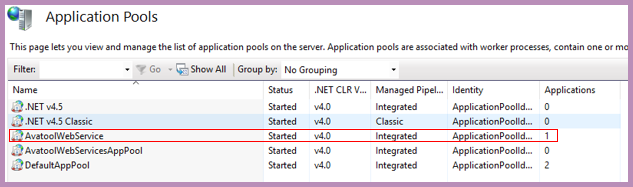
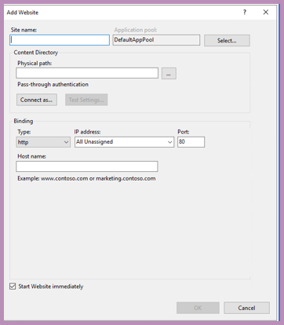
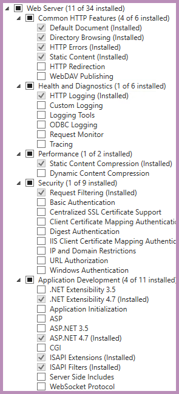
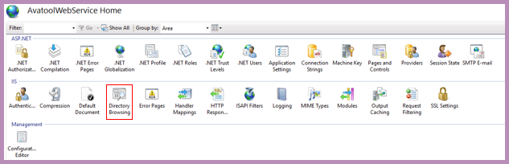
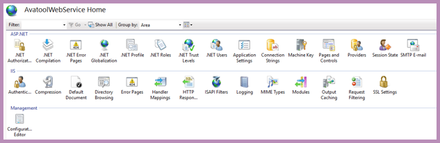

<!-- 220328.094653 -->

<h1 align="center">

  
   
  Manual
   

</h1>

<h6 align="center">
  Last updated: March 28, 2022
</h6>

***

<h3 align="center">

  [Home](manual.md)&nbsp;&bull;&nbsp;[Getting started](manual-getting-started.md)&nbsp;&bull;&nbsp;Hosting&nbsp;&bull;&nbsp;[Importing](manual-importing-maws.md)&nbsp;&bull;&nbsp;[Using](manual-using-maws.md)&nbsp;&bull;&nbsp;[ScriptLink](manual-scriptlink-events.md)&nbsp;&bull;&nbsp;[Additional information](manual-additional-information.md)

</h3>

***

#### CONTENTS
[Overview](#hosting-overview) 
[Using Microsoft IIS to host MAWS](#using-microsoft-iis-to-host-maws) 

# Overview
In order to use any web service that interfaces with myAvatar™, that web service needs to be ***hosted*** at a location that myAvatar™ has access to

There are two options for hosting MAWS:

1. **Have Netsmart host MAWS** 
If your myAvatar™ environments are hosted by Netsmart, they can also host custom web services, including MAWS. If you choose to have Netsmart host MAWS, you can skip this section of the manual, and go straight to [importing MAWS](#importing-maws). Please keep in mind that MAWS has not been tested in a Netsmart-hosted environment.
2. **Self-host MAWS** 
If you self-host your myAvatar™ environments, or would rather have complete control over your custom web services, you can self-host them. This section of the MAWS manual will offer some guidance on how to do that.

# Using Microsoft IIS to host MAWS
You can probably host MAWS using many web server/operating systems combinations, but these guidelines will focus on getting MAWS setup on Microsoft IIS.

These are the steps that I used - twice! - to host MAWS in our environment, but they are more of a *guideline* than a perfect set of instructions. It's quite possible that I didn't follow best-practices, or maybe I have something setup incorrectly, so please use caution when following these steps. And since I (hopefully?) won't have to do this again, this section will probably not be updated.

This document assumes that you already have a IIS version 10 up and running.

Please keep in mind that myAvatar™ can only communicate with web services via the HTTPS:// protocol.

## Creating an Application Pool
I’m not sure this step is necessary, but it helps to make things a little more organized…maybe? I’m not an IIS expert, so I’m not sure.

From within IIS:
1. Right-click the **Application Pools** connection
2. Choose **Add Application Pool…**

The new application pool should be a **".NET 4.0 CLR (.NET 4.5)"** pool. I’ve chosen .NET 4.5, since it lines up with the Netsmart ScriptLink Objects that we will be using.

I’ve named the application pool *AvatoolWebService*.

<h6 align="center">

  
   
  What my Application Pools setup looks like
   

</h6>

## Creating a new site
From within IIS:
1. Right-click the **Sites** connection
2. Choose **Add Website**
3. The **Site name** should be: *AvatoolWebService*
4. The **Application pool** should be: *AvatoolWebService*
5. The **Physical path** should be: */path/to/your/files/*
6. Set the binding for port :80
6. Set the binding for port :443

<h6 align="center">

  
   
  Adding a new website
   

</h6>

## Installing the ASP.NET role
ASP.NET is required by Web Services, so add the ASP.NET role to IIS.

Once that’s done, your IIS roles should look like this:

<h6 align="center">

  
   
  Probably?
   

</h6>

## Disabling the default site
Might as well do this? Probably?

From within IIS:
1. Right-click the Default Web Site
2. Choose **Manage Web Site**
3. Choose **Stop**

## Enabling directory browsing
From within IIS:
1. Double-click on the **Directory Browsing** icon
2. Choose **Enable**
3. Click **Apply**

<h6 align="center">

  
   
  Enabling directory browsing
   

</h6>

## Verifying the new site
Your AvatoolWebService site should look like this:

<h6 align="center">

  
   
  Maybe?
   

</h6>

At this point, you should be able to point a browser to your website, and see the landing page.

## Next step: Importing MAWS
Now that you have successfully hosted MAWS at your organization, we need to [import MAWS](manual-importing-maws.md) into your myAvatar™ environment.